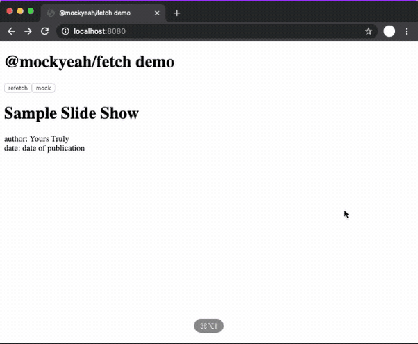

# Web Extension

We have an extension for Chrome DevTools that provides a UI to create mockyeah mocks to be used in the current page.
You can create them based on Network entries or from scratch. You can edit mocks you've created.
Chrome will save them so they're still there if you close & re-open.

The extension interacts with `@mockyeah/fetch` on your web page,
so it looks for a `window.__MOCKYEAH__` variable assigned to a `mockyeah` instance
you create in your app source code (perhaps only development builds)
with the `devTools` option enabled, as follows:

```js
import Mockyeah from "@mockyeah/fetch";

const mockyeah = new Mockyeah({
  devTools: true
});

window.__MOCKYEAH__ = mockyeah;
```

## Demo

Here's a GIF (wait for it to load) of the extension in use at https://mockyeah-fetch-demo.netlify.com/:



## Install

1. Download [the `.crx` file](https://github.com/mockyeah/mockyeah/blob/master/packages/mockyeah-web-extension/mockyeah.crx?raw=true).

2. In Chrome, go to `Settings` (the `⋮` icon in top-right corner) > `More Tools` > `Extensions`

3. Drag & drop the `.crx` extension file onto the Extensions page.
