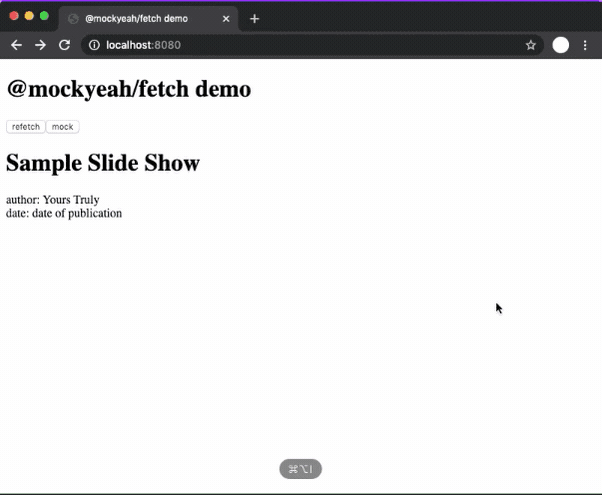

# @mockyeah/web-extension

**A powerful HTTP mocking browser extension for Chrome.**


This extension for Chrome DevTools provides a UI to create `mockyeah` mocks to be used in the current page.
You can create them based on Network entries or from scratch.
You can edit mocks you've created. Chrome will save them so they're still there if you close & re-open.

The extension interacts with `@mockyeah/fetch` on your web page, so it looks for a `window.__MOCKYEAH__` variable assigned to a `mockyeah` instance you create in your app source code (perhaps only development builds) with the `devTools` option enabled, as follows:

```js
import Mockyeah from "@mockyeah/fetch";

const mockyeah = new Mockyeah({
  devTools: true
});

window.__MOCKYEAH__ = mockyeah;
```

## Demo

Here's a GIF (wait for it to load) of the extension in use at https://mockyeah-fetch-demo.netlify.com/:



---

## Install

### Pre-packaged

1. Download [the `.crx` file](mockyeah.crx?raw=true).

2. In Chrome, go to `Settings` (the `⋮` icon in top-right corner) > `More Tools` > `Extensions`

3. Drag & drop the `.crx` extension file onto the Extensions page.

### Development

1. Clone the repo, navigate to it, and run `npm install && npm build:ci`.

2. `cd packages/mockyeah-web-extension && npm run build`

3. In Chrome, go to `Settings` (`⋮` icon in upper right corner) > `More Tools` > `Extensions`.

4. Make sure `Developer mode` is enabled via the toggle at the top of the page.

5. Click `Load unpacked` in the upper left and navigate to select the `mockyeah-web-extension` folder.

---

More at **https://mockyeah.js.org**.

## License

@mockyeah/web-extension is released under the [MIT License](https://opensource.org/licenses/MIT).
